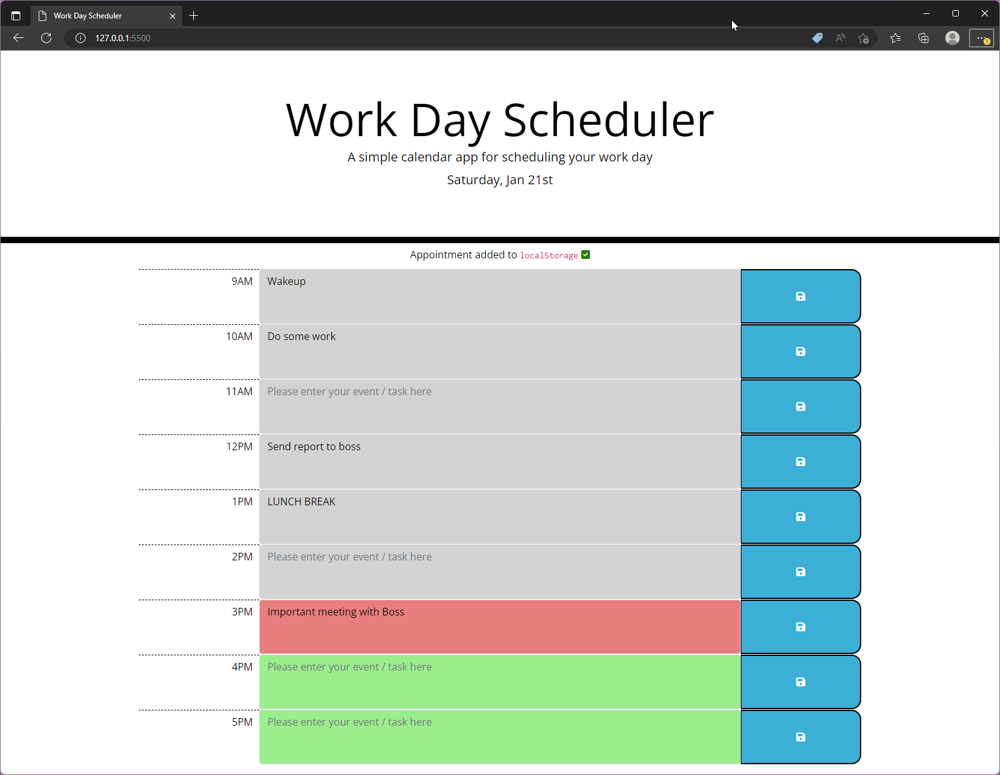

# Challenge - Work Day Scheduler

## Description

A simple scheduler application that will allow the user to enter and save tasks / events for each hour of the day. This will help you increase productivity and keep track of your work.

## Live demo

[View deployed application on Github Pages](https://gurdeep-ninja.github.io/Work-Day-Scheduler/)

## Screenshots

## Installation & usage

### Installation

Clone or download this project as a zip file & extract to your websites root directory.

Simply open the `index.html` file in your browser to use the scheduler.

### Usage

Simply enter your task / event in the textarea field and save by clicking on the blue save button. A message will  appear at the top of the scheduler indicating your task / event has been saved.

The scheduler will persist any saved events / tasks when you refresh the page.

**Note: Don't forget to hit the save button for each task!**

## Technologies
    